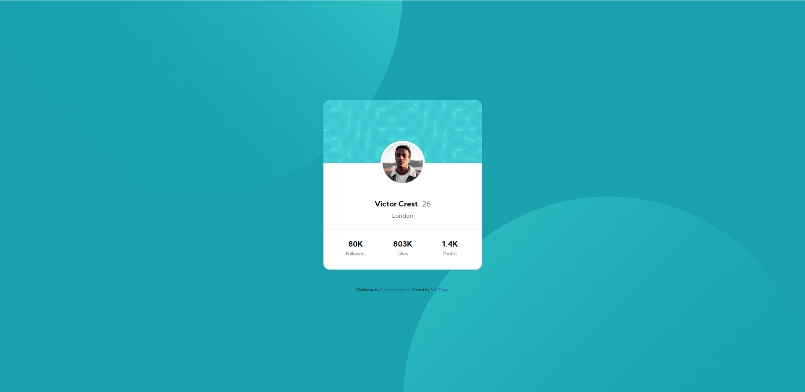

# Frontend Mentor - Profile card component solution

This is a solution to the [Profile card component challenge on Frontend Mentor](https://www.frontendmentor.io/challenges/profile-card-component-cfArpWshJ). Frontend Mentor challenges help you improve your coding skills by building realistic projects. 

## Table of contents

- [Overview](#overview)
  - [The challenge](#the-challenge)
  - [Screenshot](#screenshot)
  - [Links](#links)
- [My process](#my-process)
  - [Built with](#built-with)
  - [What I learned](#what-i-learned)
  - [Continued development](#continued-development)
- [Author](#author)
- [Acknowledgments](#acknowledgments)

## Overview

### The challenge

- Build out the project to the designs provided

### Screenshot

Desktop

Mobile

TODO!

### Links

- Solution URL: [Add solution URL here](https://github.com/stibau/profile_card_component)
- Live Site URL: [Add live site URL here](https://stibau.github.io/profile_card_component/)

## My process

### Built with

- Semantic HTML5 markup
- CSS custom properties
- Flexbox
- CSS Grid

### What I learned

* How to use background images using css and position them realtive to the viewport
* How to use flexbox to stack divs on top of each other and align them
* How create a circular image from a rectangular one
* How to use flexbox justify-content: space-evenly

### Continued development

The mobile version of this page still needs to be developed

## Author

- Frontend Mentor - [stef](https://www.frontendmentor.io/profile/stibau)

## Acknowledgments

Thanks to Valdemar Zablocki for the help on the slack channel (https://frontendmentor.slack.com/team/U0243BH7B5H)